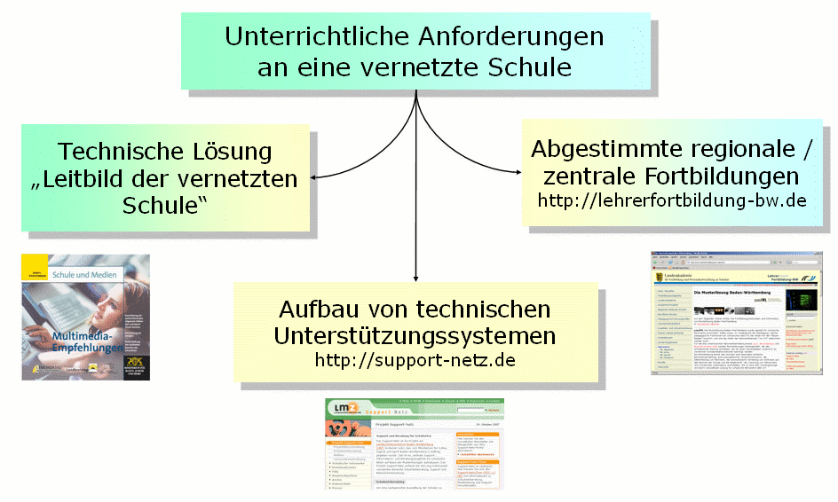
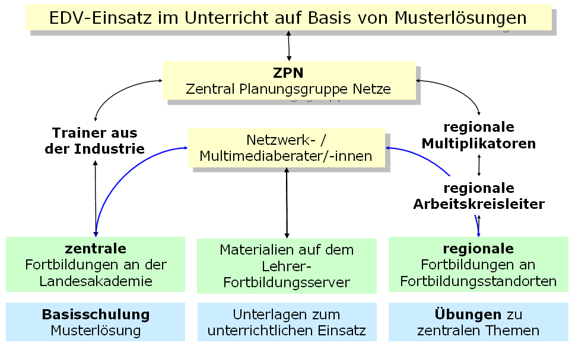
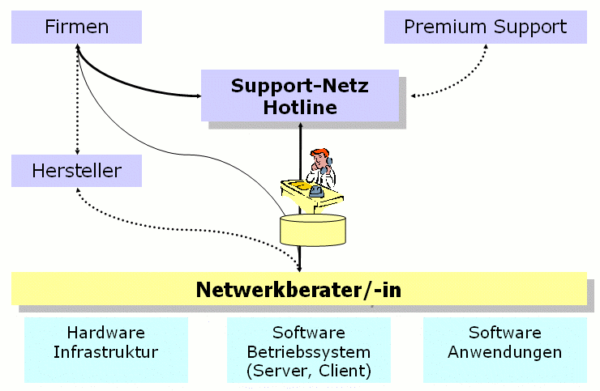
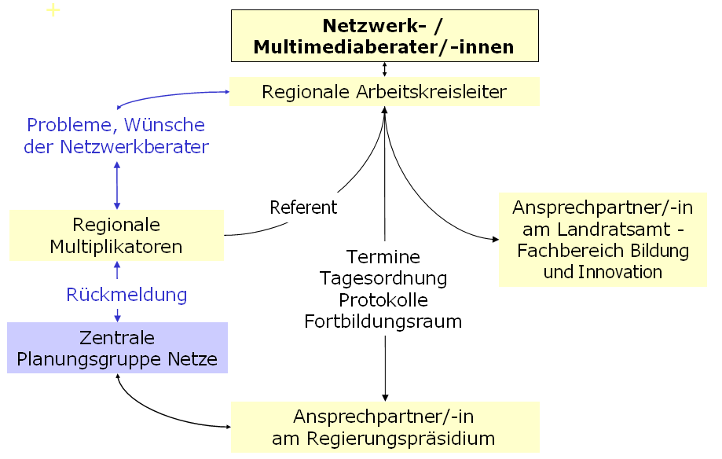
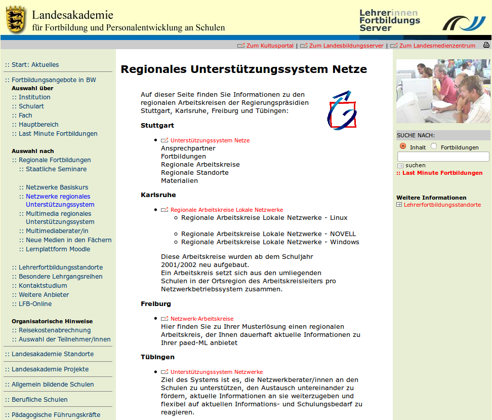
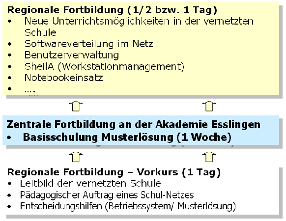
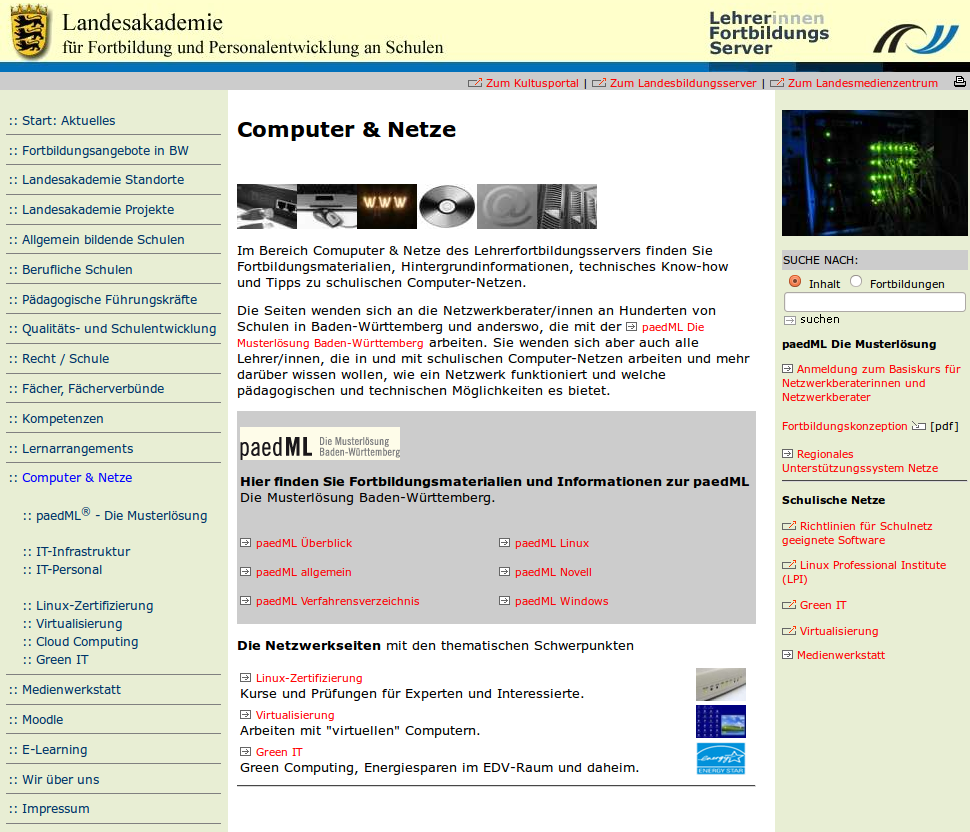
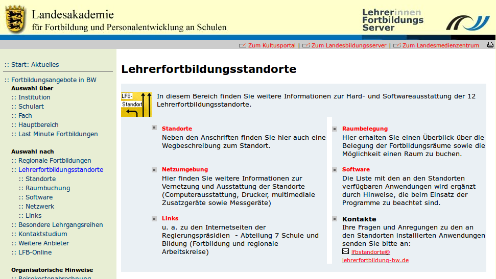
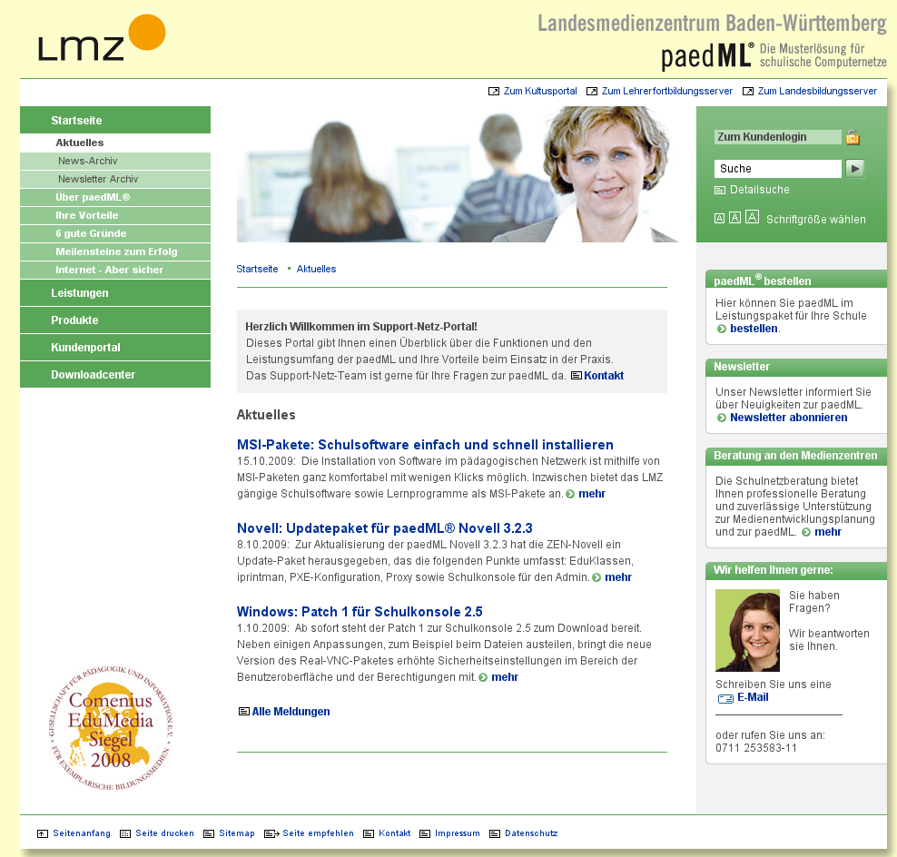

Fortbildung und Support
=======================

Stand:

Grundlage dieses Kapitels sind die
Multimedia-Empfehlungen (Ausstattung, Betreuung sowie technische Unterstützung schulischer Netze) die im Dezember 2002 gemeinsam vom Land Baden-Württemberg und den Kommunalen Landesverbänden herausgegeben wurden (siehe auch
`http://www.support-netz.de/fileadmin/tx_dcfiles/2002-MME.pdf <http://www.support-netz.de/fileadmin/tx_dcfiles/2002-MME.pdf>`_
und
`http://www.support-netz.de/fileadmin/tx_dcfiles/2005-08-09-Aktualisierung-MME.pdf <http://www.support-netz.de/fileadmin/tx_dcfiles/2005-08-09-Aktualisierung-MME.pdf>`_
) sowie die zentrale und regionale Fortbildungskonzeption auf Basis der Musterlösung (siehe auch
`http://www.lehrerfortbildung-bw.de/netz/) <http://www.lehrerfortbildung-bw.de/netz/>`_

In diesem Kapitel

*   erhalten Sie einen Einblick in die Historie der Entstehung der Musterlösung.

*   erfahren Sie, wie die Musterlösungskonzeption aussieht.

*   werden Ihnen die zentralen Strukturen der Musterlösungskonzeption

*   Zielgruppenorientierte Fortbildung

*   Technische Unterstützungssysteme

*   erfahren Sie mehr über die Aufgaben der Netzwerkberaterin/des Netzwerkberater

Historie
--------

Zu Beginn der Medienoffensive des Kultusministeriums
traf Mitte der 90er Jahre die Welle der Forderungen nach Verbesserung der schulischen IuK-Ausstattung und nach
“
Schulen ans Netz
”
vor allem im allgemeinbildenden Bereich auf Schulen, die für diese neuen Aufgaben nicht hinreichend vorbereitet waren.

Die schulinternen Netzwerke waren, falls vorhanden, häufig nicht optimal konfiguriert und im täglichen Einsatz nicht unbedingt stabil. An vielen Schulen wurde "das Rad neu erfunden". Mancherorts konnten Schülerinnen und Schüler durch bewusste oder unbewusste Veränderungen an den Arbeitsstationen den Unterrichtsbetrieb stören. Software konnte von der zuständigen Lehrkraft oft nur unter erheblichem Zeitaufwand im Netz verfügbar gemacht werden. Zuweilen fehlte auch das notwendige Spezialwissen, um die Anwendungen zu installieren bzw. entsprechend zu konfigurieren. Auf Händler konnten die Schulen aus Kostengründen nur selten zurückgreifen. Die Schulen benötigten Hilfe.

Durch das Kultusministerium wurde ein Medienbeirat mit Vertretern aus der Industrie, den Verlagen, den Hochschulen und den kommunalen Landesverbänden einberufen. Arbeitsgruppen zu den Themenbereichen Lernsoftware, Lehreraus- und -fortbildung, Finanzierung sowie Vernetzung wurden installiert. Der Medienbeirat kam in seiner Schlusssitzung im Mai 2000 unter anderem zu dem Ergebnis, dass der Ansatz der "Zentralen Planungsgruppe Netze" (ZPN), Musterlösungen als technische Leitbilder und Lösungsmodelle für schulinterne Vernetzungen zu erarbeiten, unterstützt und verfolgt werden sollte; bilden doch standardisierte
Musterlösungen eine unabdingbare Voraussetzung für den Aufbau eines effizienten, flächendeckenden technischen Unterstützungssystems.

Die langjährigen IuK-Erfahrungen im beruflichen und allgemeinbildenden Bereich hatten gezeigt, dass

*   die Verwaltung individueller Benutzer,

*   die flexible Nutzung von Programmen,

*   die Verfügbarkeit multimedialer Daten und Programme im Netz,

*   der gleichzeitige Zugang zum Internet von verschiedenen Arbeitsstationen aus und nicht zuletzt

*   die kostengünstigere Betreuung der IuK-Ausstattung

nur in einer vernetzten Schule möglich sind.

Darauf aufbauend hat die ZPN, unter der Federführung des Fortbildungsreferats im Kultusministerium, Netzwerkmusterlösungen für die drei durch die Medienoffensive des Landes unterstützten Netzwerkbetriebssysteme der Firmen Novell, Microsoft sowie dem Netzwerkbetriebssystem Linux erarbeitet
.

Im Rahmen des Pilotprojekts „Support für Schulen“ des Landes Baden-Württemberg, das von März 2001 bis Juli 2002 am Landesinstitut für Erziehung und Unterricht durchgeführt wurde, wurden wichtig Erfahrungen bzgl. der technischen Unterstützung schulischer Netze auf Basis der Novell Musterlösung gesammelt.

Auf Basis dieser Vorarbeiten wurde mit Beginn des Jahres 2003 die technische Weiterentwicklung der Musterlösung sowie der Aufbau eines technischen Unterstützungssystem im Rahmen der Medienoffensive II auf das Landesmedienzentrum übertragen. (
`http://www.support-netz.de) <http://www.support-netz.de/>`_

Die Musterlösungskonzeption
---------------------------

Ausgehend von den unterrichtlichen Anforderungen war es der Gruppe ein großes Anliegen, die Konzeptionen für die zu vernetzenden Schulen soweit wie möglich schulartunabhängig und betriebssystemübergreifend zu gestalten. Um die Abhängigkeit von Händlern zu minimieren, wurden für die Musterlösungen nur die speziellen Schulpakete der Firmen Microsoft, Novell SUSE Linux und Debian Linux berücksichtigt.

Alle Lösungen enthalten die Schulkonsole, eine plattformübergreifende grafische Oberfläche mit unterrichtlichen Funktionen wie: Druckersperre, Bildschirm-/Tastatursperre, Internetsperre, die für Netzwerkberaterinnen/Netzwerkberater und Fachlehrerinnen/Fachlehrer kostenfrei zur Verfügung gestellt werden.

Die Konzeption der Musterlösungen für die vernetzte Schule
geht dabei über die rein technische Lösung und Umsetzung hinaus.

Wichtige, aufeinander abgestimmte Bausteine sind:

*   die drei technischen Plattformen der Musterlösung mit einer entsprechend abgestimmten Händlerschulung
    „
    Aufsetzen der Musterlösung
    “
    ;

*   eine abgestimmte
    **Lehrerfortbildung**
    für die Netzwerkberaterin/den Netzwerkberater, die Multimediaberaterin/den Multimediaberater sowie in den Fachfortbildungen;

*   der Aufbau von technischen Unterstützungssystemen über das Landesmedienzentrum unter anderem mit Beratung und Support (Hotline).

|10000200000003B0000002367F854324_gif|
Zielgruppenorientierte Fortbildung
----------------------------------

Seit Beginn der Medienoffensive wurden in den vergangenen Jahren durch zentrale Fortbildung an den Akademien über 4.500 Multimedia- sowie 2.500 Netzwerk­beraterinnen und -berater geschult. Speziell wurden zentrale und regionale Fortbildungsveranstaltungen auf Basis der Musterlösung abgestimmt. Dies hat den Vorteil, dass die Netzwerkberaterin/der Netzwerkberater Schulungserkenntnisse direkt auf ihre/seine Umgebung an der Schule übertragen kann.

|10000200000003C4000002478F0FB697_gif|

Die Inhalte der
„
Basisschulung Musterlösungen
“
können dabei in regionalen Fortbildungsveranstaltungen zu
Themen wie
"
selbstheilende Arbeitsstationen -SheilA
"
,
"
Softwaredistribution - Programme im Netz
"
und
"
Benutzerverwaltung
"

an speziell ausgestatteten Standorten vertieft und geübt werden.

Multimedia- und Netzwerkberaterinnen/-berater können ihre Probleme, Wünsche und Anregungen zum einen an die regionale Multiplikatorin/den regionalen Multiplikator richten. Sie können diese jedoch auch der Arbeitskreisleiterin/dem Arbeitskreisleiter mitteilen, die/der diese dann der regionalen Multiplikatorin/dem regionalen Multiplikator weiterleitet. Die regionalen Multiplikatorinnen/Multiplikatoren geben ihrerseits diese Informationen bei den jährlichen Treffen an die Zentrale Planungsgruppe Netze weiter. Die Zentrale Planungsgruppe Netze wiederum steht in engem Kontakt mit den Ansprechpartnern am Regierungspräsidium.

|1000000000000246000001C241BBEC3B_png|
Die Arbeitskreisleiterinnen und -leiter koordinieren mit den Ansprechpartnern an den Staatlichen Schulämtern die Einladungen zu den Veranstaltungen. Sie stimmen die Termine, die Tagesordnung und die Protokolle mit den Ansprechpartnern an den Regierungspräsidium ab. Diese wiederum veröffentlichen auf ihren Internetseiten die Termine, die Tagesordnung und die Protokolle der jeweiligen Treffen.

|100002000000039700000248B9AF883E_gif|
Mit dieser Kommunikationsstruktur werden kurze und sinnvolle Wege des Informationsflusses erreicht.

Technische Unterstützungssysteme
--------------------------------

Das Support-Netz ist ein Projekt am
Landesmedienzentrum Baden-Württemberg (LMZ)
, das vom Ministerium für Kultus, Jugend und Sport Baden-Württemberg 2003 in Auftrag gegeben wurde. Ziel ist es, zentrale Support-, Informations- und Beratungsangebote für schulische Netze auf Basis der Musterlösung (
*linuxmuster.net*
) aufzubauen.

Das Projekt Support-Netz umfasst die drei eng miteinander verzahnten Bereiche:

*   Schulnetzberatung

*   Support (u.a. Hotline) und

*   Netzwerkentwicklung (linuxmuster.net, Software im Netz)

die im Folgenden näher beschrieben werden.
Quelle:
`http://www.support-netz.de <http://www.support-netz.de/>`_

|10000000000003DC000003B07077E44A_png|
Hotline
~~~~~~~

Die zentrale Hotline (Single Point of contact) ist für die Netzwerkberaterin/den Netzwerkberater die wichtigste Anlaufstelle, der sie/er ihre/seine Probleme direkt melden kann. Ferner ist dort das Netzlabor zum Nachstellen einfacherer technischer Probleme vorhanden. Alle Vorgänge im Zusammenhang mit einem Problem werden mit Hilfe einer
„
trouble ticket
“
Datenbank geführt, so dass der Bearbeitungsstand ständig rekonstruiert werden kann.

Am Landesmedienzentrum leisten seit dem Frühjahr 2003 IT-Fachleute telefonischen Support. Alle Schulen, die die Musterlösung entsprechend der technischen Vorgaben (siehe jeweilige Installationsbeschreibung und Aktualisierungen auf
`http://www.support-netz.de/kundenportal/updates-und-patches.html <http://www.support-netz.de/kundenportal/updates-und-patches.html>`_
) an der Schule einsetzen, können diese Hotline in Anspruch nehmen.

Die Anmeldung zur Hotline erfolgt i.d.R. im Zusammenhang mit der Bestellung der Musterlösung. Eine nachträgliche Anmeldung zur Hotline ist jederzeit möglich. Weitere
Informationen dazu findet man unter:
`http://support-netz.de. <http://support-netz.de/>`_

Bitte benutzen Sie folgende Hotline-Nummern und E-Mail-Adressen nur für Supportanfragen zur Musterlösung:

Linux: (0711) 25 35 83 88
`linux-hotline@lmz-bw.de <mailto:linux-hotline@lmz-bw.de>`_

Windows: (0711) 25 35 83 89
`windows-hotline@lmz-bw.de <mailto:windows-hotline@lmz-bw.de>`_

Novell: (0711) 25 35 83 90
`novell-hotline@lmz-bw.de <mailto:novell-hotline@lmz-bw.de>`_

Schulnetzberatung
~~~~~~~~~~~~~~~~~

Um eine sachgerechte Ausstattung der Schulen zu erreichen, ist im Vorfeld eine optimale Beratung aus technischer und pädagogisch-didaktischer Sicht unabdingbar. Das vermeidet Fehlinvestitionen, reduziert Kosten und ist die Voraussetzung für die sinnvolle Nutzung der beschafften Ausstattung. Aufgabe der Schulnetzberatung ist es dabei, die Erstellung und Umsetzung eines "Medienentwicklungsplans" anzustoßen, zu moderieren und zu begleiten.

Die Schulnetzberatung unterstützt bei:

*   der Erstellung von Medienentwicklungsplänen für Schulträger und Schulen;

*   der Planung, der Einrichtung, dem Betrieb und der Fortschreibung der Schulnetzwerke;

*   der Planung und Umsetzung von regionalen Supportstrukturen.

Quelle:
`http://www.support-netz.de/leistungen/beratung.html <http://www.support-netz.de/leistungen/beratung.html>`_

Software im Netz (SoN)
~~~~~~~~~~~~~~~~~~~~~~

Die SoN-Gruppe ist Teil des Projektbereichs Netzwerkentwicklung. SoN steht für Software im Netz. Der Aufgabenbereich der SoN-Gruppe umfasst alles, was mit der Installation oder dem Betrieb von (Anwender-) Software im schulischen Netzwerk zu tun hat.

Das Aufgabenspektrum der SoN-Gruppe:

*   Dokumentation der Installationsbeschreibungen zu schultypischer Software;

*   Pflege von Kontakten mit Herstellern und Distributoren;

*   Multimediaanwendungen, CDs und DVDs im Netz;

*   Definition von Anforderungen an Software in schulischen Netzen;

*   Lizenzproblematik;

*   Definition von Benutzerschnittstellen;

*   Warenkorb-Einkauf;

*   Standardisierung;

*   Repackaging von Software;

*   Umgang mit Browser Plugins;

*   Anfragen zu Software beantworten.

Quelle:
`http://www.support-netz.de/leistungen/software-im-netz.html <http://www.support-netz.de/leistungen/software-im-netz.html>`_

Netzwerkweiterentwicklung
~~~~~~~~~~~~~~~~~~~~~~~~~

Ein Aufgabenschwerpunkt der Zentralen Expertengruppe Netze (ZEN) ist die Weiterentwicklung der Musterlösungen Debian Linux, Novell SuSe Linux und Windows, wobei die wesentlichen Meilensteine in der Entwicklung der Musterlösung in der Expertenrunde ZEN - ZPN abgestimmt werden.

Händerqualifizierung
~~~~~~~~~~~~~~~~~~~~

Die Schulung „Wie setze ich eine Musterlösung auf?“ erfolgt über die Industrie- und Handelskammer und ist für die Firmen kostenpflichtig. Neben der Installation der Musterlösung wird insbesondere auf die Konfiguration, Pflege und Wartung der Systeme eingegangen. Durch die Händerqualifizierung wird ein weiterer Baustein der technischen Unterstützungssysteme, die Wartung und Betreuung der schulischen Netze durch Firmen, gestärkt. Schulträger können bei Firmen technischen Support einkaufen, die Netzwerkberaterin/der Netzwerkberater wird vor Ort unterstützen.

Die folgende Grafik soll die oben beschriebenen Strukturen für die tägliche Arbeit der Netzwerkberaterin/des Netzwerkberaters noch einmal verdeutlichen:

|10000200000002E4000001E368A98FE0_gif|
Das wichtigste in Kürze
-----------------------

Der Lehrerfortbildungsserver
~~~~~~~~~~~~~~~~~~~~~~~~~~~~

Über den Lehrerfortbildungserver
`http://www.lehrerfortbildung-bw.de <http://www.lehrerfortbildung-bw.de/>`_

finden Sie unter Begriff Netzwerke weitere Fortbildungsmaterialien zu den drei Musterlösungen.

|10000000000003CA00000340F041223F_png|
Regionale Fortbildungen
~~~~~~~~~~~~~~~~~~~~~~~

Im Rahmen der Fortbildungen an den regionalen Fortbildungsstandorten können Sie mit Netzwerkberaterinnen und Netzwerkberatern über die aufgetretenen Probleme sprechen, da sie die gleichen Systeme nutzen –
**Sie sind nicht mehr alleine**
!

Wenn Sie diesen Basiskurs abgeschlossen haben, sollten Sie sich an ihrem nächsten Arbeitskreis anmelden.

Diesen finden Sie auf der Homepage des Lehrerfortbildungsserver
`http://www.lehrerfortbildung-bw.de/fortbildungen/ak_netz <http://www.lehrerfortbildung-bw.de/fortbildungen/ak_netz>`_
In den regionalen Arbeitskreisen werden Sie ständig betreut und fortgebildet. Sie erfahren Neuigkeiten der Musterlösung und werden gezielt an regionalen Standorten darin geschult.

|10000000000003CC0000033D1C079D01_png|

Regionale Fortbildungsstandorte
~~~~~~~~~~~~~~~~~~~~~~~~~~~~~~~

Alle regionalen Fortbildungsstandorte inkl. Wegbeschreibung sowie Raumbelegung finden Sie unter
`http://lehrerfortbildung-bw.de/fortbildungen/lfbstandorte/ <http://lehrerfortbildung-bw.de/fortbildungen/lfbstandorte/>`_

|10000000000003CB00000223DF3FCEF6_png|
Unter dem Stichwort SOFTWARE finden Sie neben den Standardprogrammen (Office, LibreOffice, Tools, Grafik, Multimedia) auch alle Programme, die innerhalb der verschiedenen Fachfortbildungen (z. B: Deutsch, Chemie, Physik, Mathematik, Fächerverbünde) eingesetzt werden.

LFB – Mailinglisten
~~~~~~~~~~~~~~~~~~~

Eine weitere Möglichkeit Lösungen zu bestimmten Problemen zu finden, ist der Eintrag der Netzwerkberaterin/des Netzwerkberaters in eine Mailingliste. In der Mailingliste diskutieren Netzwerkberater ihre Probleme und Lösungen. Multiplikatoren und Entwickler geben hier Tipps.

Per Mail können Sie sich in die betreffende Liste einschreiben.

**Linux Mailingliste**

`http://lehrerfortbildung-bw.de/netz/muster/linux/material/kontakt/ <http://lehrerfortbildung-bw.de/netz/muster/linux/material/kontakt/>`_

**Novell Mailingliste**
`http://lehrerfortbildung-bw.de/netz/muster/novell/material/kontakte/ <http://lehrerfortbildung-bw.de/netz/muster/novell/material/kontakte/>`_

**Windows Mailingliste**

`http://www.lehrerfortbildung-bw.de/netz/muster/win2000/kontakt.html <http://www.lehrerfortbildung-bw.de/netz/muster/win2000/kontakt.html>`_

In die hier angegebene Mailingliste sollte sich jede Netzwerkberaterin/jeder Netzwerkberater, seiner Musterlösung entsprechend, eintragen. Dort erhält sie/er gezielt Hilfe durch engagierte Kolleginnen und Kollegen, die ihren bereits erworbenen Erfahrungsschatz gerne zur Verfügung stellen
.

Netzinfos über den Lehrerfortbildungsserver
~~~~~~~~~~~~~~~~~~~~~~~~~~~~~~~~~~~~~~~~~~~

In der Übersicht sind alle notwendigen Quellen aufgelistet, auf die die Netzwerkberaterin/der Netzwerkberater online zugreifen kann:

Regionale Fortbildung:

`http://lehrerfortbildung-bw.de/fortbildungen/rp/ak_netz/ <http://lehrerfortbildung-bw.de/fortbildungen/rp/ak_netz/>`_

Der Lehrerfortbildungsserver:

`http://lehrerfortbildung-bw.de/netz/ <http://lehrerfortbildung-bw.de/netz/>`_

Weitere Informationen zur linuxmuster.net:

`http://lehrerfortbildung-bw.de/netz/muster/linux/ <http://lehrerfortbildung-bw.de/netz/muster/linux/>`_

Informationen des Landesmedienzentrums
~~~~~~~~~~~~~~~~~~~~~~~~~~~~~~~~~~~~~~

*   Musterlösung und technischer Support:
    `http://www.support-netz.de  <http://www.support-netz.de/>`_

*   Musterlösung bestellen:
    `http://www.support-netz.de/produkte.html <http://www.support-netz.de/produkte.html>`_
    ` <http://www.support-netz.de/nml-bestellen.html>`_

*   Schulnetzberatung:
    `http://www.support-netz.de/leistungen/beratung.html <http://www.support-netz.de/leistungen/beratung.html>`_
    ` <http://www.support-netz.de/schulnetzberatung.html>`_

*   Software im Netz (SON):

    `http://www.support-netz.de/leistungen/software-im-netz.html <http://www.support-netz.de/leistungen/software-im-netz.html>`_
    ` <http://www.support-netz.del/>`_
    Für die Installation von Software gibt es die in Deutschland einmalige Einrichtung
    SoN (Software im Netz). Hier wird von Kolleginnen und Kollegen die Installation von Programmen im Netz auf Basis der Musterlösung beschrieben und auf Fehler oder Installationsvorschläge hingewiesen. Ebenso werden Hinweise gegeben, wie man sinnvolle Einstellungen wählt. Gibt es Probleme mit einer noch nicht beschriebenen Software, kann man sich an die Gruppe wenden.
    Hinweis:
    Zur vereinfachten Installation von
    schultypischer Software plant das LMZ die Bereitstellung vorgefertigter Installationspakete. Aktuelle Informationen werden bereitgestellt unter:

    `http://www.support-netz.de/kundenportal/msi-pakete.html <http://www.support-netz.de/kundenportal/msi-pakete.html>`_

